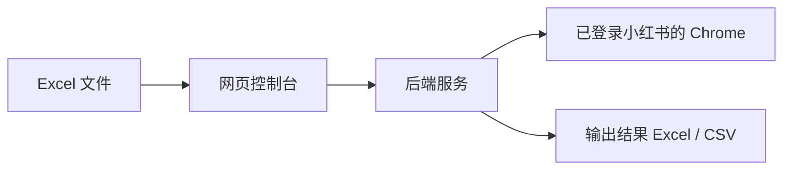

# 使用教程

这份教程写给完全没接触过编程的同学。目标只有一个：在一台新电脑上，把这个项目下载下来，按步骤运行起来，然后用网页批量处理小红书笔记 Excel。

项目地址：

```text
https://github.com/cnbatmoven/xhs-agent.git
```

本教程默认使用 Windows 10 / Windows 11。你不需要理解所有命令的原理，先照着做，看到和教程类似的结果就继续下一步。

## 1. 这个工具能做什么

这个工具会读取 Excel 里的小红书笔记链接，然后批量补全这些信息：

- 标题、封面、正文文案、话题
- 点赞数、收藏数、评论数、分享数
- 达人昵称、达人 ID、达人链接、粉丝量
- 评论区前 20 条
- 蒲公英报价和 CPE
- 内容类型、核心卖点、创意建议、人群圈选策略

它有两种使用方式：

- 网页版：推荐新同学使用，打开浏览器上传 Excel，点按钮运行。
- 命令行版：适合开发同学或批量自动化使用。

新同学只看网页版流程即可。

## 2. 先理解这 3 个东西

运行这个项目时，会同时打开 3 个窗口。它们都很重要，运行期间不要关闭。



3 个窗口分别是：

- 小红书登录 Chrome：专门用来保持小红书登录状态。
- 后端服务 PowerShell：负责真正读取 Excel、抓网页、生成结果。
- 前端网页 PowerShell：负责启动你看到的网页控制台。

请记住一个判断方法：

- 如果某个 PowerShell 窗口一直停在那里，没有回到可以输入命令的状态，通常不是卡住，而是服务正在运行。
- 想停止服务时，在对应 PowerShell 窗口按 `Ctrl + C`。

## 3. 先安装需要的软件

第一次使用一台新电脑时，需要先安装这些软件。安装过就不用重复安装。

### 3.1 Google Chrome

下载地址：

```text
https://www.google.com/chrome/
```

用途：登录小红书，让工具可以读取需要登录后才能看到的页面。

### 3.2 Python

下载地址：

```text
https://www.python.org/downloads/
```

安装时一定要勾选：

```text
Add python.exe to PATH
```

装好后，重新打开一个 PowerShell，输入：

```powershell
python --version
```

如果看到类似下面内容，就表示成功：

```text
Python 3.10.11
```

只要是 `3.10`、`3.11`、`3.12` 或更高版本都可以。

如果提示 `python 不是内部或外部命令`，通常是安装时没有勾选 `Add python.exe to PATH`。最简单的处理方式是重新安装 Python，并确认勾选这个选项。

### 3.3 Node.js

下载地址：

```text
https://nodejs.org/
```

请选择页面上写着 `LTS` 的版本。

装好后，重新打开 PowerShell，输入：

```powershell
node --version
npm --version
```

两个命令都能看到版本号，就表示成功。

### 3.4 Git

下载地址：

```text
https://git-scm.com/downloads
```

用途：从 GitHub 下载项目、以后更新项目代码。

安装时一路默认即可。装好后，重新打开 PowerShell，输入：

```powershell
git --version
```

能看到版本号就表示成功。

如果你只是临时使用，也可以在 GitHub 页面点 `Code`，再点 `Download ZIP` 下载压缩包。但团队一起开发、后续拿最新版本，推荐安装 Git。

## 4. 打开 PowerShell

PowerShell 可以理解成一个“输入电脑指令的窗口”。

打开方式：

1. 按键盘上的 `Win` 键。
2. 输入 `PowerShell`。
3. 点击 `Windows PowerShell`。

复制教程里的命令后，在 PowerShell 里粘贴，再按回车。

建议一行一行执行。如果某一步报错，不要继续往下跑，先处理当前报错。

## 5. 下载项目

建议把项目放在一个简单路径里，不要放在桌面，也不要放在带很多中文或空格的路径里。

本教程统一使用：

```text
C:\xhs-work\xhs-agent
```

打开 PowerShell，执行：

```powershell
New-Item -ItemType Directory -Force -Path C:\xhs-work
cd C:\xhs-work
git clone https://github.com/cnbatmoven/xhs-agent.git
cd xhs-agent
```

确认你已经进入项目文件夹：

```powershell
pwd
```

应该看到类似：

```text
C:\xhs-work\xhs-agent
```

以后教程里说“项目根目录”，指的就是这个文件夹。

如果你用的是 `Download ZIP`，请把压缩包解压到 `C:\xhs-work`，并把解压出来的文件夹改名为 `xhs-agent`。

## 6. 第一次安装项目依赖

这一步只需要在第一次使用时做一次。以后每天使用，不用重复安装，除非项目更新后提示依赖变化。

### 6.1 安装后端依赖

确认你在项目根目录：

```powershell
cd C:\xhs-work\xhs-agent
```

创建一个独立的 Python 环境：

```powershell
python -m venv .venv
```

激活这个环境：

```powershell
.\.venv\Scripts\Activate.ps1
```

如果出现“不允许运行脚本”之类的报错，执行一次：

```powershell
Set-ExecutionPolicy -Scope CurrentUser RemoteSigned
```

它可能会问你是否确认，输入：

```text
Y
```

然后重新执行：

```powershell
.\.venv\Scripts\Activate.ps1
```

激活成功后，PowerShell 前面通常会出现：

```text
(.venv)
```

然后安装 Python 依赖：

```powershell
python -m pip install --upgrade pip
pip install -r requirements.txt
```

安装 Playwright 浏览器组件：

```powershell
python -m playwright install chromium
```

如果 `pip install` 很慢，可以试试国内镜像：

```powershell
pip install -i https://pypi.tuna.tsinghua.edu.cn/simple -r requirements.txt
```

### 6.2 安装前端依赖

继续在项目根目录执行：

```powershell
cd frontend
npm install
cd ..
```

如果 `npm install` 很慢，可以先设置 npm 镜像：

```powershell
npm config set registry https://registry.npmmirror.com
npm install
cd ..
```

如果你已经在 `frontend` 文件夹里，最后一行 `cd ..` 会回到项目根目录。

## 7. 准备 Excel 文件

你的 Excel 文件需要满足两个条件。

第一个条件：里面有一个工作表，名字叫：

```text
笔记明细
```

注意这是 Excel 底部的 sheet 名称，不是 Excel 文件名。

第二个条件：表里至少有一列小红书笔记链接。常见列名可以是：

```text
笔记链接
笔记URL
链接
```

建议第一次测试只放 1 到 5 条链接，不要一上来跑几十条。

示例：

| 笔记链接 | 备注 |
| --- | --- |
| https://www.xiaohongshu.com/explore/xxxx | 第一条测试 |
| https://www.xiaohongshu.com/explore/yyyy | 第二条测试 |

运行前建议关闭这个 Excel 文件，避免文件被 Excel 占用导致上传或写入失败。

## 8. 第一次启动：打开小红书登录浏览器

这一步的目的是打开一个“专用 Chrome”。工具会通过这个 Chrome 访问小红书。

打开一个新的 PowerShell，进入项目根目录：

```powershell
cd C:\xhs-work\xhs-agent
```

执行下面命令：

```powershell
$PROJECT = (Get-Location).Path
$CHROME = "$env:ProgramFiles\Google\Chrome\Application\chrome.exe"
if (!(Test-Path $CHROME)) { $CHROME = "${env:ProgramFiles(x86)}\Google\Chrome\Application\chrome.exe" }
& $CHROME --remote-debugging-port=9222 --user-data-dir="$PROJECT\chrome-debug-profile" --no-first-run --no-default-browser-check https://www.xiaohongshu.com
```

执行后会弹出一个新的 Chrome 窗口。

在这个 Chrome 里：

1. 打开小红书。
2. 扫码登录。
3. 如果后面要抓蒲公英报价，也在这个 Chrome 里登录蒲公英后台。
4. 登录完成后，不要关闭这个 Chrome。

确认登录浏览器正常：

```text
http://127.0.0.1:9222/json
```

用浏览器打开上面地址。如果看到一段文字或 JSON，说明这个专用 Chrome 已经连上。

如果打不开，先关闭刚才打开的专用 Chrome，再重新执行本步骤的命令。

## 9. 第二个窗口：启动后端服务

再打开一个新的 PowerShell。注意这是第二个 PowerShell 窗口。

进入项目根目录：

```powershell
cd C:\xhs-work\xhs-agent
```

激活 Python 环境：

```powershell
.\.venv\Scripts\Activate.ps1
```

启动后端：

```powershell
python -m uvicorn backend.app:app --host 127.0.0.1 --port 8001
```

看到类似下面内容就表示成功：

```text
Uvicorn running on http://127.0.0.1:8001
```

这个窗口不要关闭。它负责处理任务。

你可以用浏览器打开：

```text
http://127.0.0.1:8001/health
```

正常会看到类似：

```json
{
  "status": "ok",
  "queue_size": 0
}
```

只要里面有 `"status":"ok"` 或 `"status": "ok"`，就说明后端正常。

## 10. 第三个窗口：启动网页控制台

再打开一个新的 PowerShell。注意这是第三个 PowerShell 窗口。

进入前端目录：

```powershell
cd C:\xhs-work\xhs-agent\frontend
```

启动网页：

```powershell
npm run dev
```

看到类似下面内容就表示成功：

```text
Local: http://127.0.0.1:5173/
```

打开它显示的地址：

```text
http://127.0.0.1:5173/
```

如果显示的是 `5174` 或其他端口，就打开实际显示的地址。

这个 PowerShell 窗口也不要关闭。它负责提供网页控制台。

## 11. 在网页里跑第一条任务

第一次不要追求跑完全部数据，先验证流程能跑通。

打开网页控制台后，按顺序操作：

1. 找到中间的“上传文件并描述任务”区域。
2. 点击“上传”，选择你的 Excel 文件。
3. 在“运行设置”里确认这些参数。

推荐第一次测试参数：

| 设置 | 推荐值 | 说明 |
| --- | --- | --- |
| 条数上限 | `1` | 第一次只跑 1 条，最快定位问题 |
| Chrome CDP | `http://127.0.0.1:9222` | 对应第 8 步打开的专用 Chrome |
| 抓取间隔 | `20` 或 `30` | 慢一点更稳 |
| 蒲公英间隔 | `12` | 第一次不开蒲公英也可以保持默认 |
| 仅离线分析 | 关 | 要抓网页就关闭 |
| 下载封面 | 开 | 会把封面下载到结果里 |
| 嵌入封面 | 开 | 会把封面放进 Excel |
| 抓蒲公英 | 关 | 第一次先关，等小红书流程稳定后再开 |
| 蒲公英安全模式 | 开 | 以后开蒲公英时更稳 |
| 启用 LLM | 关 | 第一次先关，避免 API Key 问题影响测试 |

然后点击：

```text
提交任务
```

任务状态大概会经历：

```text
queued -> running -> succeeded
```

含义：

- `queued`：任务已排队。
- `running`：正在处理。
- `succeeded`：处理成功。
- `failed`：处理失败，需要看日志。

成功后，右侧结果区会出现下载按钮：

- `Excel`
- `CSV`

输出文件也会保存在项目目录的：

```text
outputs
```

## 12. 以后每天怎么使用

第一次安装完成后，以后每天使用只需要做 3 件事。

### 12.1 打开登录浏览器

PowerShell 1：

```powershell
cd C:\xhs-work\xhs-agent
$PROJECT = (Get-Location).Path
$CHROME = "$env:ProgramFiles\Google\Chrome\Application\chrome.exe"
if (!(Test-Path $CHROME)) { $CHROME = "${env:ProgramFiles(x86)}\Google\Chrome\Application\chrome.exe" }
& $CHROME --remote-debugging-port=9222 --user-data-dir="$PROJECT\chrome-debug-profile" --no-first-run --no-default-browser-check https://www.xiaohongshu.com
```

确认小红书已经登录。

### 12.2 启动后端

PowerShell 2：

```powershell
cd C:\xhs-work\xhs-agent
.\.venv\Scripts\Activate.ps1
python -m uvicorn backend.app:app --host 127.0.0.1 --port 8001
```

### 12.3 启动前端网页

PowerShell 3：

```powershell
cd C:\xhs-work\xhs-agent\frontend
npm run dev
```

然后打开它显示的网页地址，例如：

```text
http://127.0.0.1:5173/
```

## 13. 怎么停止

停止后端：

1. 找到运行 `uvicorn` 的 PowerShell。
2. 按 `Ctrl + C`。

停止前端：

1. 找到运行 `npm run dev` 的 PowerShell。
2. 按 `Ctrl + C`。

停止登录浏览器：

直接关闭第 8 步打开的专用 Chrome 窗口即可。

## 14. 仅离线分析模式

如果你只想先验证 Excel 能不能读，不想打开小红书页面，可以使用“仅离线分析”。

网页里这样设置：

```text
仅离线分析 = 开
抓蒲公英 = 关
启用 LLM = 关
```

这种模式不抓网页，只分析 Excel 里已有的数据。它适合快速检查表格格式是否正确。

## 15. 使用 LLM 分析

LLM 是用来生成更丰富的创意建议、人群圈选策略等内容的。

如果你没有 API Key，可以跳过这一节。

如果你有 OpenAI-compatible API Key，例如 OpenAI、DeepSeek 或公司内部兼容服务，需要在启动后端之前设置环境变量。

操作方式：

1. 如果后端正在运行，先在后端 PowerShell 里按 `Ctrl + C` 停掉。
2. 在同一个 PowerShell 里设置环境变量。
3. 重新启动后端。

示例：

```powershell
cd C:\xhs-work\xhs-agent
.\.venv\Scripts\Activate.ps1
$env:LLM_API_KEY="这里换成你的 API Key"
$env:LLM_BASE_URL="这里换成你的服务商 Base URL"
$env:LLM_MODEL="这里换成你的模型名"
python -m uvicorn backend.app:app --host 127.0.0.1 --port 8001
```

然后在网页里打开：

```text
启用 LLM = 开
```

第一次建议只跑 1 到 3 条，确认结果正常后再增加数量。

重要提醒：

- API Key 不要发到群里。
- API Key 不要写进公开文档。
- API Key 不要提交到 GitHub。

## 16. 使用蒲公英报价

蒲公英报价比普通小红书页面更容易遇到登录、权限和安全验证问题。建议先把普通小红书采集跑通，再打开蒲公英。

准备工作：

1. 使用第 8 步打开的专用 Chrome。
2. 在同一个 Chrome 里登录蒲公英后台。
3. 不要关闭这个 Chrome。

网页里推荐这样设置：

| 设置 | 推荐值 |
| --- | --- |
| 抓蒲公英 | 开 |
| 蒲公英安全模式 | 开 |
| 蒲公英间隔 | `12` 或更高 |
| 条数上限 | 第一次 `1` 到 `3` |

如果稳定，再慢慢增加数量。

建议批量大小：

- 普通小红书采集：每批 10 到 50 条。
- 蒲公英报价：每批 1 到 10 条。

不要一开始就跑很大的批次。

## 17. 遇到安全验证怎么办

如果 Chrome 出现这些情况：

- 验证码
- 安全验证
- 操作太频繁
- 页面要求重新登录
- 内容突然抓不到

建议这样处理：

1. 先停止继续跑大批量任务。
2. 在专用 Chrome 里手动完成验证或重新登录。
3. 等 10 到 30 分钟。
4. 把网页里的“抓取间隔”调大，例如 `30` 或 `60`。
5. 把每批数量调小。

不要连续快速重试。连续重试通常只会更容易触发风控。

## 18. 团队同学怎么拿最新版本

如果你是用 Git 下载的项目，以后团队更新了代码，你可以这样拿最新版本。

先停止后端和前端，也就是在对应 PowerShell 里按 `Ctrl + C`。

然后打开 PowerShell：

```powershell
cd C:\xhs-work\xhs-agent
git pull
```

如果提示已经是最新，类似：

```text
Already up to date.
```

说明本地已经是最新版本。

如果更新后项目提示缺依赖，可以重新执行：

```powershell
.\.venv\Scripts\Activate.ps1
pip install -r requirements.txt
cd frontend
npm install
cd ..
```

普通使用同学一般只需要 `git pull`，不需要提交代码。

## 19. 开发同学提交代码

这一节只给要改代码的同学看。纯使用同学可以跳过。

每天开始开发前：

```powershell
cd C:\xhs-work\xhs-agent
git pull
```

改完代码后：

```powershell
git status
git add .
git commit -m "这里写你的修改说明"
git push
```

不要提交这些目录：

```text
outputs/
data/
browser-profile/
chrome-debug-profile/
frontend/node_modules/
frontend/dist/
```

这些目录已经写在 `.gitignore` 里，正常不会被提交。

## 20. 常见问题

### 20.1 PowerShell 提示 python 不是命令

原因通常是 Python 没装好，或者安装时没有勾选 `Add python.exe to PATH`。

处理方式：

1. 重新安装 Python。
2. 确认勾选 `Add python.exe to PATH`。
3. 关闭所有 PowerShell。
4. 重新打开 PowerShell。
5. 再执行：

```powershell
python --version
```

### 20.2 PowerShell 提示 npm 不是命令

原因通常是 Node.js 没装好，或者安装后没有重新打开 PowerShell。

处理方式：

1. 重新安装 Node.js LTS。
2. 关闭所有 PowerShell。
3. 重新打开 PowerShell。
4. 再执行：

```powershell
node --version
npm --version
```

### 20.3 激活 .venv 时提示不允许运行脚本

执行：

```powershell
Set-ExecutionPolicy -Scope CurrentUser RemoteSigned
```

输入：

```text
Y
```

然后重新执行：

```powershell
.\.venv\Scripts\Activate.ps1
```

### 20.4 pip install 很慢或失败

可以使用国内镜像：

```powershell
pip install -i https://pypi.tuna.tsinghua.edu.cn/simple -r requirements.txt
```

如果还是失败，先确认 Python 版本：

```powershell
python --version
```

建议使用 Python 3.10 或更高版本。

### 20.5 npm install 很慢或失败

可以设置 npm 镜像：

```powershell
npm config set registry https://registry.npmmirror.com
npm install
```

注意：这两个命令要在 `frontend` 文件夹里执行。

### 20.6 网页打不开

先看运行 `npm run dev` 的 PowerShell，里面会显示真正的网页地址。

常见是：

```text
http://127.0.0.1:5173/
```

但如果 `5173` 被占用，它可能会变成：

```text
http://127.0.0.1:5174/
```

以 PowerShell 实际显示的地址为准。

### 20.7 网页显示后端离线

确认后端是否正在运行。

打开：

```text
http://127.0.0.1:8001/health
```

如果打不开，说明后端没有启动成功。回到第 9 步重新启动后端。

### 20.8 Chrome CDP 连不上

打开：

```text
http://127.0.0.1:9222/json
```

如果打不开，说明专用 Chrome 没有正常启动。

处理方式：

1. 关闭专用 Chrome。
2. 回到第 8 步重新执行启动命令。
3. 确认 `Chrome CDP` 填的是：

```text
http://127.0.0.1:9222
```

### 20.9 Excel 提示找不到工作表

确认 Excel 底部的 sheet 名称叫：

```text
笔记明细
```

不是文件名叫 `笔记明细`，而是 Excel 里面的工作表标签叫 `笔记明细`。

### 20.10 结果为空或很多 failed

常见原因：

- 没有登录小红书。
- 专用 Chrome 被关掉了。
- `Chrome CDP` 地址填错了。
- 小红书触发安全验证。
- 链接失效。
- 跑得太快。

建议：

1. 先只跑 1 条。
2. 把抓取间隔改成 `30`。
3. 关闭蒲公英和 LLM。
4. 确认专用 Chrome 里小红书是登录状态。

### 20.11 端口被占用

如果后端提示 `8001` 被占用，最简单的方式是重启电脑后再试。

如果你想手动处理，可以查看占用进程：

```powershell
netstat -ano | findstr :8001
```

最后一列是进程 ID。假设看到的进程 ID 是 `12345`，可以结束它：

```powershell
taskkill /PID 12345 /F
```

如果前端端口 `5173` 被占用，通常不用处理，Vite 会自动换到 `5174` 或其他端口。

## 21. 最短速查版

第一次安装：

```powershell
New-Item -ItemType Directory -Force -Path C:\xhs-work
cd C:\xhs-work
git clone https://github.com/cnbatmoven/xhs-agent.git
cd xhs-agent
python -m venv .venv
.\.venv\Scripts\Activate.ps1
pip install -r requirements.txt
python -m playwright install chromium
cd frontend
npm install
cd ..
```

每天使用，开 3 个窗口。

PowerShell 1，登录浏览器：

```powershell
cd C:\xhs-work\xhs-agent
$PROJECT = (Get-Location).Path
$CHROME = "$env:ProgramFiles\Google\Chrome\Application\chrome.exe"
if (!(Test-Path $CHROME)) { $CHROME = "${env:ProgramFiles(x86)}\Google\Chrome\Application\chrome.exe" }
& $CHROME --remote-debugging-port=9222 --user-data-dir="$PROJECT\chrome-debug-profile" --no-first-run --no-default-browser-check https://www.xiaohongshu.com
```

PowerShell 2，后端：

```powershell
cd C:\xhs-work\xhs-agent
.\.venv\Scripts\Activate.ps1
python -m uvicorn backend.app:app --host 127.0.0.1 --port 8001
```

PowerShell 3，前端：

```powershell
cd C:\xhs-work\xhs-agent\frontend
npm run dev
```

打开前端显示的网页地址，上传 Excel，第一次参数建议：

```text
条数上限 = 1
Chrome CDP = http://127.0.0.1:9222
抓取间隔 = 20 或 30
抓蒲公英 = 关
启用 LLM = 关
```
